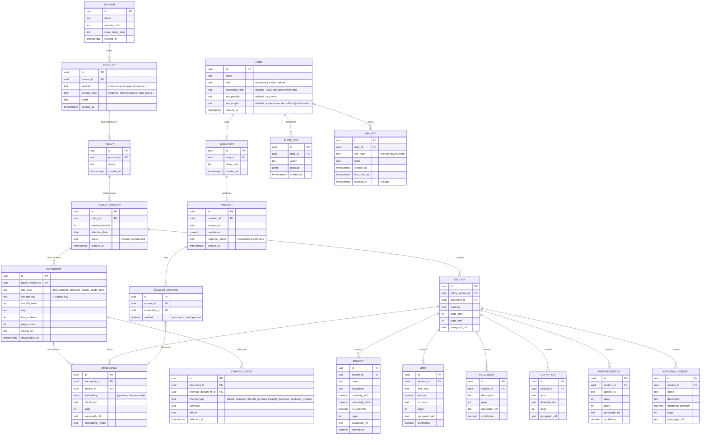

# Database ERD

Relational core in PostgreSQL; embeddings live in the same database via `pgvector` (one store,
one backup story, one transaction boundary between a fact and its embedding — avoids the
drift you get from a separate vector DB).

Schema is **vertical-agnostic by design** (see `01-ARCHITECTURE.md`): `Product.vertical` and
`Product.product_type` are the only fields that vary by product line; every other table is
shared by insurance, mortgages, KiwiSaver, etc. when those phases start.

## Notes

- **`Section` is the join point** between structure (page/paragraph location) and every
  extracted-fact table — this is what lets the comparison engine say "AMI's retaining-wall
  clause is in Section 4.2, page 12" rather than just "somewhere in this PDF."
- **`ANSWER_CITATION.verified`** is written by the citation-verification step in the query
  engine (see `05-AI-EXTRACTION-STRATEGY.md`): a boolean the API refuses to omit. An answer
  with zero verified citations is not returned to the user — it's logged and surfaced in
  admin as a retrieval gap instead.
- **`confidence`** exists on every extracted-fact table, not just as a global answer score —
  this is what lets the admin console show "which specific benefit-extractions are low
  confidence" (per the brief's admin requirement) rather than only document-level confidence.
- No per-tenant partitioning in Phase 1 (single shared corpus). If B2B API licensing becomes a
  real product (see challenge doc #6), tenant scoping is added at the `USER`/`API_KEY` layer, not
  by duplicating the document corpus.
- **`USER.password_hash` is nullable** — password auth and Microsoft Entra SSO are both valid
  ways to authenticate (see `10-AUTH-AND-ACCOUNTS.md`); an SSO-only user has `sso_provider`/
  `sso_subject` set and no password. `role` stays PolicyIQ-owned regardless of login method — no
  external identity provider's group/role claims are trusted for RBAC.
- **`API_KEY`** is separate from browser sessions: long-lived, `key_hash`-verified (never the raw
  key), no refresh/rotation flow. This is the mechanism for the B2B/broker "API option" product
  surface referenced above, and for scripts/integrations that can't do an interactive login
  redirect.
