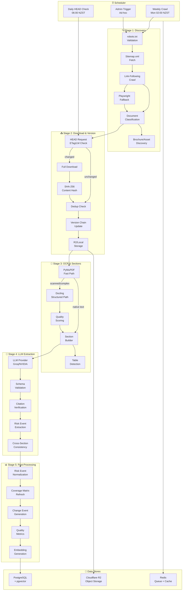
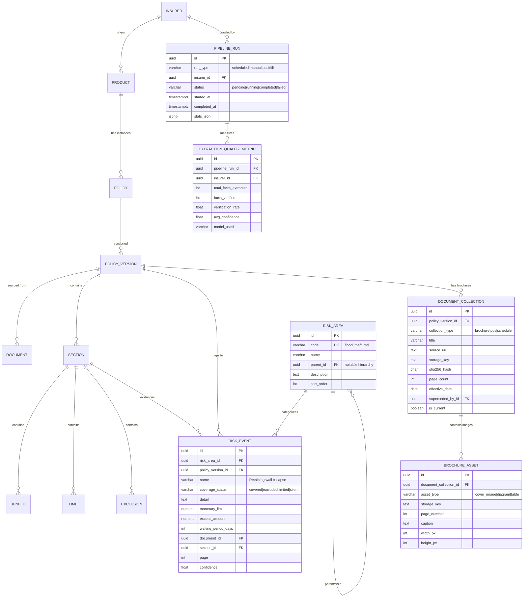
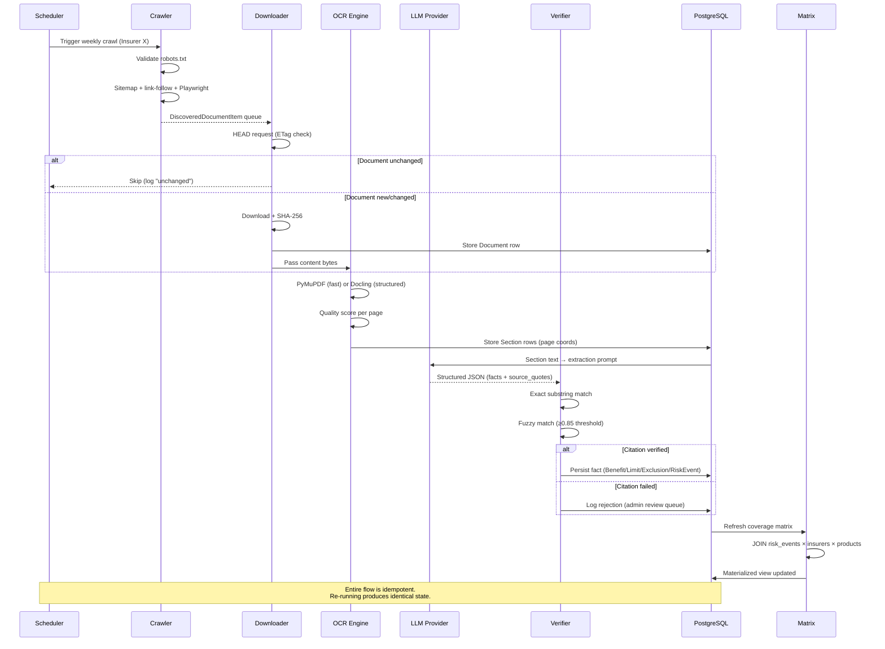
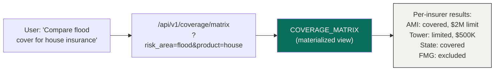
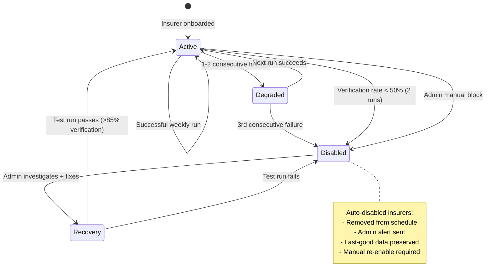

# Architecture Diagrams — PolicyIQ Scraping System

## 1. End-to-End Pipeline Flow

## 2. Data Model (Extended ERD)

## 3. Weekly Scheduling Timeline

```mermaid
gantt
    title Weekly Pipeline Schedule (Monday NZST)
    dateFormat HH:mm
    axisFormat %H:%M

    section Health
    HEAD check all URLs       :active, health, 02:00, 15min

    section General Insurers
    AMI + State + NZI         :crit, groupA, 02:15, 10min
    Tower + Vero + AA         :crit, groupB, 02:25, 10min
    FMG + MAS + TradeMe       :groupC, 02:35, 10min

    section Life Insurers
    AIA + Partners + Fidelity :groupD, 02:45, 15min

    section Health Insurers
    Southern Cross + nib      :groupE, 03:00, 10min

    section Specialty
    SPCA + Cove + 1Cover      :groupF, 03:10, 10min

    section Post-Processing
    Matrix refresh            :matrix, 03:30, 30min
    Quality report            :quality, 04:00, 15min
    Change digest             :digest, 04:15, 10min
```

## 4. Data Flow: From PDF to Comparison

## 5. Coverage Comparison Query Path

## 6. Failure & Recovery State Machine

